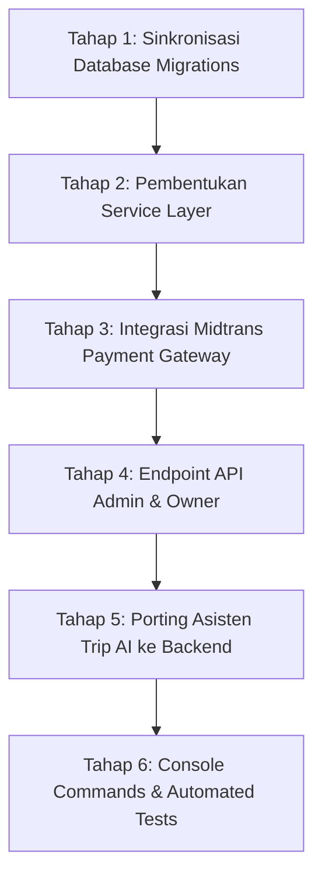

# Catatan Progres & Analisis Kebutuhan Backend
## Sistem Informasi Sewa dan Penjualan Perlengkapan Outdoor — Annapurna Adventure
**Referensi:** Dokumen Teknis (Technical Specification) Versi 1.0 (2 Oktober 2026)  
**Terakhir Diperbarui:** 6 Oktober 2026  

---

## 1. Ringkasan Status Proyek

Aplikasi **Annapurna Adventure** saat ini telah memiliki antarmuka (UI/UX) berbasis Blade + Vanilla CSS + JavaScript yang **100% presisi dan sangat matang** sesuai dengan Dokumen Teknis Bab 10. Logika bisnis sewa, perhitungan denda, alur checkout, aturan sistem pakar Asisten Trip, dan simulasi operasional admin/owner telah berjalan dengan baik di sisi klien (frontend / `public/assets/js/`).

Namun, arsitektur backend Laravel saat ini masih bersifat **fondasi / hybrid**:
- Sebagian besar data operasional masih disimpan di state klien (`data.js` / localStorage).
- Backend Laravel baru memuat migrasi 15 tabel dasar dari total 32 tabel di dokumen teknis.
- Lapisan `app/Services/` dan integrasi SDK Midtrans belum diimplementasikan di server.

File catatan ini merangkum perbandingan detail komponen per komponen serta peta jalan (*roadmap*) pengembangan backend agar sistem **100% sesuai dengan Dokumen Teknis**.

---

## 2. Matriks Kesesuaian Komponen (Dokumen Teknis vs Kode Saat Ini)

| Bab Dokumen | Deskripsi Komponen | Status Saat Ini | Keterangan |
| :--- | :--- | :---: | :--- |
| **Bab 1 & 2** | Stack Teknologi (PHP 8.2, Laravel 12, MySQL 8, Dompdf, Excel) | ⚠️ **Sebagian** | Core Laravel 12, Dompdf, Excel sudah terpasang di `composer.json`. Paket `midtrans/midtrans-php` belum diinstal. |
| **Bab 2.4** | Autentikasi & Otorisasi (`EnsureRole`, Session, Bcrypt) | ✅ **Sesuai** | Guard web, proteksi role `admin` & `owner`, auto-logout saat staff dinonaktifkan sudah berjalan di [EnsureRole.php](file:///d:/KULIAH%20SEMESTER%207/IUM%20COMPRO%20PROECT/Annapurna/annapurna/app/Http/Middleware/EnsureRole.php). |
| **Bab 2.7** | Scheduler & Queue Jobs (`bookings:expire-unpaid`, dsb.) | ❌ **Belum Ada** | Belum ada scheduled commands di `app/Console/Commands` atau [console.php](file:///d:/KULIAH%20SEMESTER%207/IUM%20COMPRO%20PROECT/Annapurna/annapurna/routes/console.php). |
| **Bab 3 & 4** | Kebutuhan Sistem & 22 Use Case (UC-01 s/d UC-22) | ⚠️ **Sebagian** | UI dan simulasi lengkap; integrasi penuh database di backend masih perlu disambungkan. |
| **Bab 3 (NF-02)** | Audit Trail Hash Chain SHA-256 (`activity_logs`) | ✅ **100% Sesuai** | Model [ActivityLog.php](file:///d:/KULIAH%20SEMESTER%207/IUM%20COMPRO%20PROECT/Annapurna/annapurna/app/Models/ActivityLog.php) dan [Audit.php](file:///d:/KULIAH%20SEMESTER%207/IUM%20COMPRO%20PROECT/Annapurna/annapurna/app/Support/Audit.php) sudah memiliki append-only, genesis 64 nol, dan fungsi verifikasi `firstBrokenId()`. |
| **Bab 5** | Siklus Status & Formula Bisnis (DP 50%, denda jam 18.00, refund H-2) | ✅ **Sesuai** | Logika perhitungan dan enum status sudah sesuai di rule sistem dan [ApiController.php](file:///d:/KULIAH%20SEMESTER%207/IUM%20COMPRO%20PROECT/Annapurna/annapurna/app/Http/Controllers/Annapurna/ApiController.php). |
| **Bab 6 & 7** | ERD & Kamus Data (32 Tabel Database) | ⚠️ **Perlu Penyesuaian** | Baru ada 15 tabel migrasi bisnis di backend. 17 tabel pendukung belum dimigrasikan. |
| **Bab 8.1** | Service Layer Backend (`app/Services/`) | ❌ **Belum Ada** | Belum ada direktori `app/Services/`. Logika bisnis masih berada di frontend dan controller. |
| **Bab 9** | Route & Endpoint API | ⚠️ **Sebagian** | Route halaman web lengkap. Endpoint backend untuk panel Admin & Owner (`/api/admin/*`, `/api/owner/*`) belum dibuat. |
| **Bab 10** | Desain UI/UX & CSS Design Tokens | ✅ **100% Sesuai** | Seluruh variabel warna (`--g950`, `--g700`, `--gold`, `--cream`, dll.), font `Figtree`, dan `Kaushan Script` presisi di [style.css](file:///d:/KULIAH%20SEMESTER%207/IUM%20COMPRO%20PROECT/Annapurna/annapurna/public/assets/css/style.css). |
| **Bab 11** | Asisten Trip AI (NLP & Forward-Chaining) | ⚠️ **Jalan di Klien** | 100% sesuai aturan dokumen di [ai.js](file:///d:/KULIAH%20SEMESTER%207/IUM%20COMPRO%20PROECT/Annapurna/annapurna/public/assets/js/ai.js). Belum memiliki endpoint backend `POST /api/ai/plan` dan `POST /api/chat`. |
| **Bab 12** | Integrasi Midtrans Snap & Webhook | ❌ **Belum Ada** | Belum ada pembuatan Snap token, webhook endpoint, dan verifikasi SHA-512 signature di server. |
| **Bab 13** | Database Seeder & Akun Bawaan | ✅ **100% Sesuai** | Akun default (owner, dita, customer) persis sesuai di [DatabaseSeeder.php](file:///d:/KULIAH%20SEMESTER%207/IUM%20COMPRO%20PROECT/Annapurna/annapurna/database/seeders/DatabaseSeeder.php). |
| **Bab 14** | Skenario Pengujian Black Box | ⚠️ **Belum Otomatis** | Belum ada berkas automated test di `tests/Feature/` dan `tests/Unit/`. |

---

## 3. Rincian Kesenjangan (*Gaps*) yang Perlu Dilengkapi

### 3.1. Database & Migrasi (Bab 6 & 7)
Total tabel pada dokumen teknis adalah **32 tabel** (+1 `payment_logs` = 33 tabel). Saat ini migrasi baru mendefinisikan 15 tabel bisnis.

#### Tabel yang Perlu Dibuat:
1. `product_variants`: Relasi varian ukuran ke produk (saat ini masih tersimpan sebagai JSON `variant_data` di `products`).
2. `booking_item_units`: Pivot nomor unit fisik barang yang diserahterimakan saat sewa keluar.
3. `attributes` & `attribute_category`: Master data atribut filter barang.
4. `unit_logs`: Riwayat status per unit fisik (keluar, kembali, cuci, perbaikan).
5. `booking_changes`: Tabel pengajuan ganti barang oleh penyewa.
6. `booking_extensions`: Tabel pengajuan perpanjangan sewa (maks. 14 hari).
7. `booking_histories`: Linimasa perjalanan rental per booking.
8. `refunds`: Pencatatan refund pembatalan, nominal, dan rekening tujuan.
9. `review_products`: Relasi N:M ulasan ke banyak barang.
10. `customer_notes`: Catatan flag pelanggan oleh Owner (`normal`, `jaminan`, `blacklist`).
11. `sops`: Standar Operasional Prosedur staff toko.
12. `login_codes`: Kode OTP login sekali pakai (masa berlaku 10 menit).
13. `monthly_archives`: Rekap bulanan periode YYYY-MM untuk Google Drive.
14. `payment_logs`: Penyimpanan mentah payload webhook Midtrans dan hasil verifikasi signature.
15. Pemisahan `expenses` dan `incomes` (saat ini digabung dalam tabel `finances`).

#### Penyesuaian Kolom pada Tabel yang Sudah Ada:
* **`bookings`**:
  - Dokumen menspesifikasikan Primary Key berupa `VARCHAR(20)` dengan format kode `RNT-1001` (bukan big integer auto-increment).
  - Penambahan kolom: `out_at`, `out_cond`, `out_by`, `return_at`, `return_cond`, `late_days`, `damage_fee`, `return_by`, `cancel_at`, `cancel_reason`.
* **`products`**:
  - Kolom harga jual di dokumen adalah `sell_price`, saat ini bernama `sale_price`.
  - Kolom `service_every` (siklus servis per n kali sewa) perlu ditambahkan.
* **`payments`**:
  - Dokumen menggunakan relasi polimorfik (`payable_type`, `payable_id`) untuk menghubungkan rental atau penjualan.
  - Penambahan kolom gateway Midtrans: `gateway`, `gateway_order_id`, `snap_token`, `snap_redirect_url`, `gateway_transaction_id`, `payment_type`, `va_number`, `gateway_status`, `fraud_status`, `expired_at`.

---

### 3.2. Lapisan Service Backend (`app/Services/`) (Bab 8.1)
Dokumen merinci 17 kelas Service yang perlu diimplementasikan:
1. **`AvailabilityService`**: Menghitung ketersediaan unit fisik per rentang tanggal per produk, per ukuran, dan per paket sewa dengan `lockForUpdate`.
2. **`PricingService`**: Menghitung lama sewa, subtotal, DP (default 50%), hari keterlambatan, dan denda (mode persen / nominal).
3. **`PromoService`**: Validasi kuota promo, minimal order, periode aktif, dan pengurangan kuota.
4. **`BookingService`**: Alur pembuatan rental, pembatalan, perpanjangan, dan penggantian barang.
5. **`PaymentService`**: Upload bukti transfer, verifikasi admin, penolakan, pelunasan di toko.
6. **`RentalService`**: Pencatatan serah terima barang keluar (pilih unit) dan barang kembali (cek kondisi, denda).
7. **`UnitService`**: Manajemen status unit inventaris fisik, pencatatan servis / cuci berkala.
8. **`SaleService`**: Alur transaksi pembelian barang toko dan pengurangan stok.
9. **`RefundService`**: Kalkulasi hak refund (≥ H-2 dapat 100%, < H-2 hangus) dan pemrosesan transfer.
10. **`FinanceService`**: Pencatatan kas masuk, kas keluar, rekap saldo, dan pembatalan transaksi (*void*).
11. **`ReportService`**: Pembuatan laporan rental, penjualan, keuangan, serta ekspor PDF & Excel.
12. **`ArchiveService`**: Rekap bulanan otomatis dan integrasi Google Drive API.
13. **`StaffService`**: Tambah akun staff, reset password sementara, kirim email undangan.
14. **`ChatbotService`**: Menjawab pertanyaan FAQ berdasarkan konfigurasi toko (`settings`).
15. **`TripPlannerService`**: Ekstraksi entitas teks bebas dan penyusunan rekomendasi alat / paket (porting dari `ai.js`).
16. **`InsightService`**: Analitik ulasan pelanggan, rekomendasi barang sering disewa bersama, ringkasan laporan.
17. **`ForecastService`**: Prediksi kebutuhan unit barang 14 hari ke depan berdasarkan data historis sewa.

---

### 3.3. Integrasi Midtrans Payment Gateway (Bab 12)
Fitur yang harus disiapkan:
1. **Instalasi:** `composer require midtrans/midtrans-php`.
2. **Konfigurasi (.env & config/midtrans.php):**
   - `MIDTRANS_MERCHANT_ID`
   - `MIDTRANS_SERVER_KEY`
   - `MIDTRANS_CLIENT_KEY`
   - `MIDTRANS_IS_PRODUCTION` (default `false`)
   - `MIDTRANS_DP_EXPIRY_MINUTES` (default `60`)
3. **`MidtransService`:**
   - Pembuatan Snap Token (`createSnap()`).
   - Cek status transaksi Midtrans (`status()`).
   - Pembatalan transaksi belum bayar (`cancel()`).
   - Verifikasi Signature SHA-512: `hash('sha512', $order_id . $status_code . $gross_amount . $server_key)`.
4. **Endpoint & Webhook:**
   - `POST /api/bookings/{id}/pay` (membuat Snap token untuk pop-up checkout).
   - `POST /api/payments/midtrans/notification` (webhook penerima notifikasi otomatis, bebas CSRF).
   - Penanganan idempoten dengan `lockForUpdate`.
   - Update otomatis status booking ke `dikonfirmasi` saat status Midtrans `settlement` / `capture accept`.

---

### 3.4. Scheduler & Queue Jobs (Bab 2.7)
Perintah Artisan yang perlu dibuat:
* `php artisan bookings:expire-unpaid`: Menghapus/membatalkan booking tanpa bukti DP melewati batas waktu 60 menit (tiap 15 menit).
* `php artisan rentals:return-reminder`: Kirim notifikasi pengingat ke penyewa yang jadwal kembalinya hari ini (tiap hari jam 08.00).
* `php artisan rentals:mark-overdue`: Menandai rental yang belum kembali lewat jam 18.00 dan menghitung denda harian (tiap hari jam 00.05).
* `php artisan reports:monthly-archive`: Membuat arsip PDF/Excel bulanan dan unggah ke Google Drive (tanggal 1 jam 06.00).

---

## 4. Peta Jalan Implementasi Backend (Roadmap)

Tahapan pengerjaan yang disarankan saat melanjutkan pengembangan:

1. **Tahap 1: Sinkronisasi Database Migrations**
   - Buat migrasi untuk sisa tabel (variants, units pivot, changes, extensions, refunds, payment_logs, dll.).
   - Perbarui model Eloquent dengan relasi yang sesuai Dokumen Teknis Bab 6.1.
2. **Tahap 2: Pembentukan Service Layer**
   - Buat folder `app/Services/` dan implementasikan service utama: `AvailabilityService`, `PricingService`, `BookingService`, `PaymentService`, `RentalService`.
3. **Tahap 3: Integrasi Midtrans Payment Gateway**
   - Install SDK Midtrans, buat `MidtransService`, dan webhook notification handler dengan validasi signature SHA-512.
4. **Tahap 4: Endpoint API Admin & Owner**
   - Buat controller untuk route `/api/admin/*` dan `/api/owner/*`.
   - Hubungkan tombol aksi pada modal di `admin.js` agar memanggil backend endpoint via `fetch()`.
5. **Tahap 5: Porting Asisten Trip AI ke Backend**
   - Pindahkan logika dari `ai.js` ke `TripPlannerService` dan `ChatbotService` dengan endpoint `POST /api/ai/plan` dan `POST /api/chat`.
6. **Tahap 6: Scheduled Jobs & Automated Tests**
   - Buat console commands di `routes/console.php`.
   - Tulis unit/feature test untuk skenario T-01 s/d T-14 dan MT-01 s/d MT-07 di folder `tests/`.

---

## 5. Kredensial Akun Pengujian Default

Akun yang sudah terpasang dan aktif di [DatabaseSeeder.php](file:///d:/KULIAH%20SEMESTER%207/IUM%20COMPRO%20PROECT/Annapurna/annapurna/database/seeders/DatabaseSeeder.php):
* **Owner:** `owner@annapurna.id` / `owner123`
* **Admin / Staff:** `dita@annapurna.id` / `dita123`
* **Customer:** `customer@annapurna.id` / `customer123`
